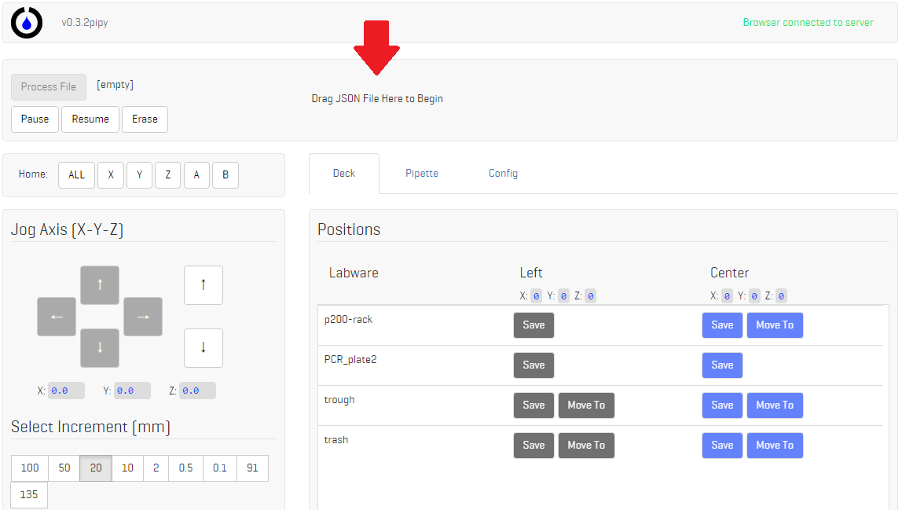
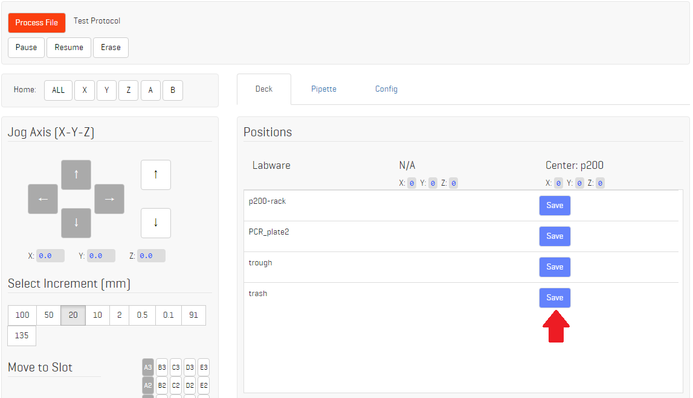
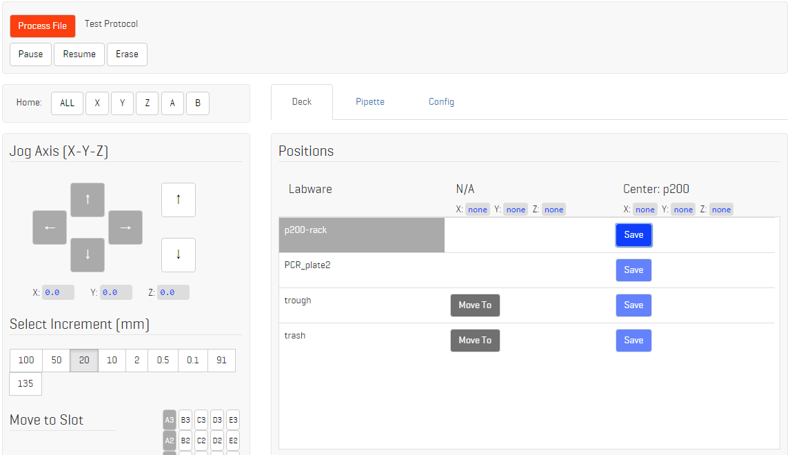
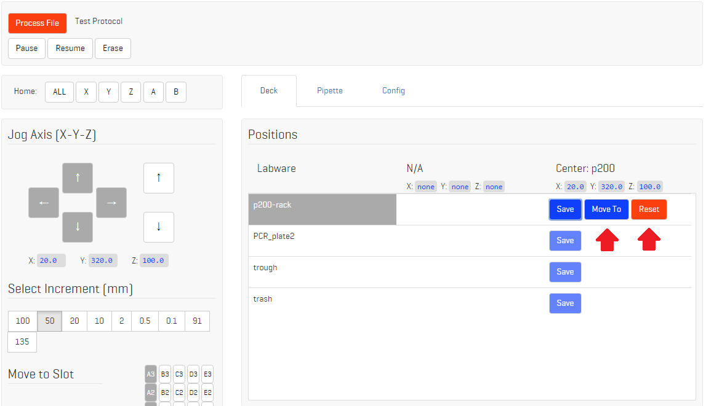
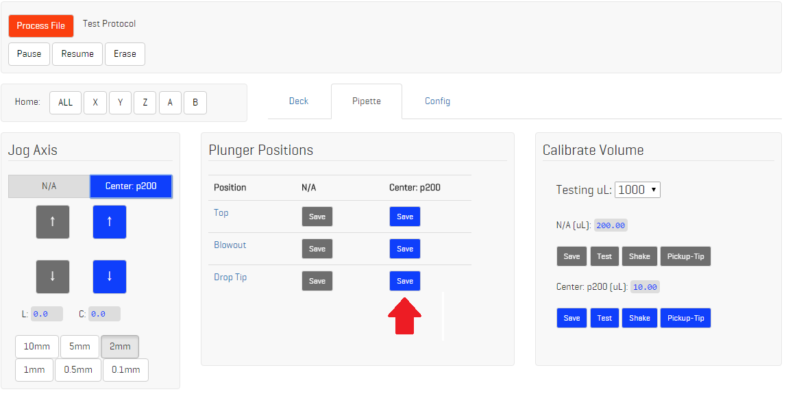
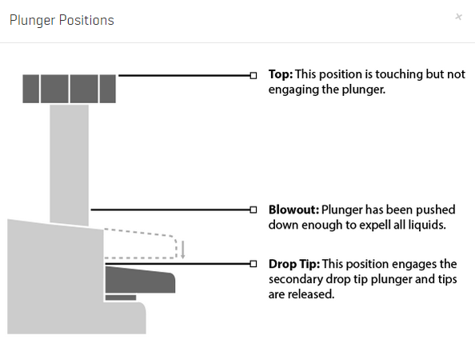
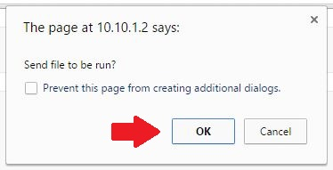

## 1. Drag JSON file into interface

OpenTrons jobs are described in JSON files that the robot reads as instruction set. You download these files from [Mix.Bio](http://mix.bio). You can choose a pre-made JSON document from the Protocol Database that is ready to run, or customize your own in the [Protocol Editor](http://editor.mix.bio). Once you have the protocol you want downloaded, drag that file into the Setup / Run interface.

## 2. Save the tip-rack positions

The JSON protocol tells the machine the set of instructions to run, but you need to help it find the physical locations those instructions correspond to. You do this by jogging the robot to the correct position and saving it. As you can see in the interface below, each piece of labware used in the protocol just popped up in the "Positions" section with a "save" button.

The first position you save should be your tip rack. Select that position then jog your robot so that the pipette is hovering directly over the A1 tip of the rack that it will use for the run.

When you think the pipette is well positioned directly above the tip, flip to the "Pipette" section of the interface, select the correct pipette, and hit "pick up tip." The machine will go up and down three times in an attempt to pick up the tip.

NOTE: the distance the machine moves down the Z axis to pick up the tip is defined in the "tip plunge" field in the Pipette definition in the Head section of the JSON OT protocol document.

If the machine picked up the tip satisfactorily, go back to the "Deck" section and save that position. If it did not go low enough to pick up the tip securely, jog it down the Z axis slightly and try pushing "pick up tip" again. If it seems the robot is putting lots of force on the pipette when it picks up the tip, jog up the Z axis, eject the tip, and try pressing "pick up tip" again. Save the position that will consistently pick up the tip without applying too much force and damaging your pipette.

Nice! Now you have saved your first position. Once you"ve saved a position, a "move-to" button will appear by it. That allows you to go directly to that position to test it out just by clicking it -- no need to jog there again.

### Resetting positions after a crash

When you save a tip-rack, an orange "reset" button also appears next to that position. This is for you to use when you crash the robot. This is a when, not an if -- everyone who uses an OT.One will accidently press the jog button too many times and cause the robot to try and go further than possible and crash into itself at some point. After this happens, don"t panic, just re-home everything.

After you re-establish a zero point for the robot, your saved positions might be a little off, depending on how bad the crash was. To see if they are off, hit the "move-to" button next to your saved tip rack position. If the robot moves back to the correct position, you are all good. If it moved to a position that is a little off the mark, however, that means that every position you saved is now off by the same amount. Never fear, you only have to re-save the tip-rack position and hit "Reset." That will correct all of the saved positions for that pipette according to the adjustment you made for the tip rack.

## 3. Calibrate the pipettes

You need to save three positions for each pipette: top, blow-out, and tip-drop. Select the pipette you are going to work with and jog the actuator up and down to find each position, then save it.

Top: This position is where the robot barely touches the top of the pipette plunger, but does not compress the plunger. Effectively the zero for that axis.

Blow-out: This is the position where the "soft-stop" is on the pipette. You can find this by pressing the pipette down with your finger and feeling the difference between the furthest down "hard stop" and the intermediate "soft-stop" of the plunger -- the soft stop offers resistance but you can still press beyond it to the hard stop. You need to save the robot in position where it pushes to the "soft-stop."

Drop tip: This is the position where the robot has ejected the tip.

### Set all pipette positions

In order to calibrate the robot to the proper volume, you must first set initial positions for the Top, Blowout and Drop Tip positions of the pipette.  Set the Blowout position as low as it can go without the dropping the tip.

### Select testing volume

Choose the testing volume that matches the maximum volume of the pipette you are using, even if it may not be the volume you"re planning on using.  Once the maximum volume is calibrated, the robot takes care of the rest!

### Visually calibrate

Make sure the pipette tip is in a deck position above a container that has water in it (higher volume that the pipette can pick up).  Select the Test button and make sure the pipette picks up liquid.  The pipette tips have markings on the sides to indicate volume, jog the pipette position axis up and down to visually calibrate to the proper mark.

### Save position

Once you are satisfied with the visual calibration, select the Save button.

### Weigh test liquid (optional)

If you have a scale, you can adjust the calibration based on how much the water in the tip weighs (1 mL = 1 g).  Use the Test button to pick up liquid, and then move the pipette over to the scale and select the Blowout position to deposit the liquid on the scale.  Select the test function again, and jog the axis up if the weight is too low or jog the axis down if the weight is too high.  Select the save button to update the volume.

## 4. Process Job

This will set your machine to run the job! When you hit the button, the first pop-up you are encountered with asks if you"d like to save the run to disk. Generally you don't need to keep the run file saved, but it is good for debugging purposes down the line. For now, hit "cancel."

Next it will prompt you to begin the run -- hit ok.

When you first run a protocol, it is best to do it dry. Next, do it with water. Then, change the tips out so they are sterile, and run it with your real samples and reagents as many times as you want!
