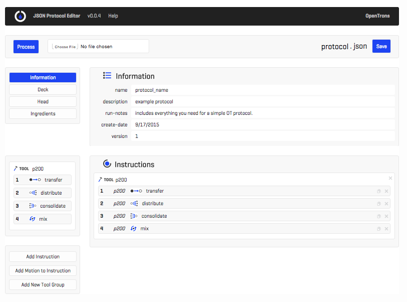
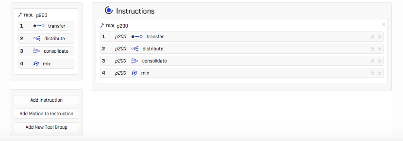
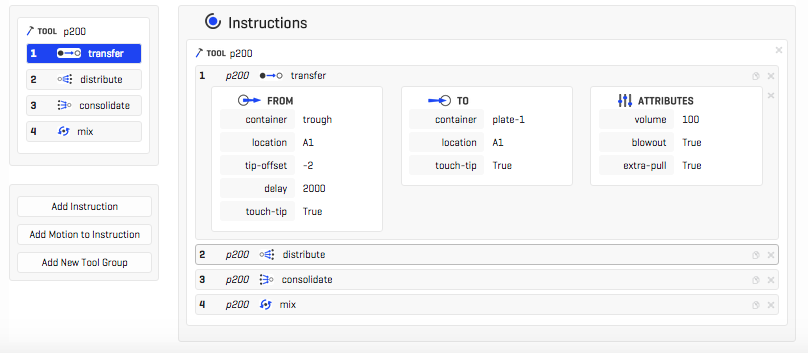

# Choose and Edit a Protocol

The OT.One runs protocols based on OT-Protocol JSON documents like this one: [protocol.json](docs/protocol.json)

This is an OT-Protocol JSON document explained: [OT-Protocol JSON Explained](docs/ot-protocol_spec.md)

([JSON](http://json.org/) is just a way of structuring textual data hierarchically, and OT-Protocol is just JSON used in a way specific to liquid handling robots)

##### 1- Download OT-Protocol Document from Mix.Bio

Each protocol document specifies the which pipette(s) are on the robot head, what labware is on the robot deck, and then what instructions the robot follows for a given run. Find the OT-Protocol document that seems to be closes to what you are looking for in the [Mix.Bio Protocol Library](http://mix.bio/protocols/p10s) and download it.

You can choose a basic template and start a protocol from scratch, or download something specific like a 10x 96-well-plate Serial Dilution or PCR 8-Strip Sample Prep.

##### 2- Edit OT-Protocol

You can view and edit your newly downloaded OT-Protocol document with the [Protocol Editor](http://editor.mix.bio/). (You can also view and edit the raw code with a text editor if debugging JSON is more your style :)

You have to add an OT-Protocol document to the editor by browsing for it, or dragging the file directly in as shown here:

Then, click 'Process File." When it has processed, it should look something like this:

Now you can start editing your protocol.

*Note:* To change the value in a feild, just click the field and type in the new value. The new value is saved when you click back out of that field (click on something neutral, not a different field).

#### Info Section

The Info section specifies 'meta' information about the document. All of these fields are optional.

#### Head Section

The head section specifies what pipettes are attached to the robot, in which position, and what their attributes are. You can do things here like change the rate the robot moves the plunger (slow it down for more viscous material for example) and define which tip-rack & trash location each pipette should use.

*Note: The robot is designed for single-channel pipettes to be put on the Left, and multi-channel pipettes to be put on the Center motor. If you are only using a single-channel, you can put it on the center, but if you are using a single- and a multi-channel at the same time, the single-channel needs to be on the left.*

#### Deck Section

The deck section is where you declare all the labware you're using in a given run. It always needs to include at least one tip rack for the pipette you are using, and one trash for the pipette to eject tips into. Other than that, you can add things like 96-well-plates and microfuge tube racks to your hearts content (or you fill up the 15 deck slots).

The labware definitions specify the exact physical demensions of each piece of labware in the OpenTrons Labware Library. The  profile in the Labware Library tells the machine where, for example, each well in a 96-well-plate is, based on only a single user calibrated XYZ position. Thats why, when you calibrate the positions for a given protocol during the next step, you only have to save one position per piece of labware, and the robot can figure out the rest of the locations at runtime.

_Note: When adding items to the deck, you can type whatever you want in the 'Name:' field (something descriptive like 'Source Plate' or 'Reagent Trough' is generally encouraged), but the value you enter in the 'Labware:' field must correspond exactly to a value in the Labware Library. You should copy and paste the text from the Labware Library document below:_

[OpenTrons Labware Library 1.0](Labware_Library.md)

After you have added all of the labware you need on your deck, you can start defining the instructions.

#### Instructions

The instructions are the bulk of the protocol, specifying the liquid handling operations the OT.One carries out in a given run. Instructions are in 'tool blocks' based on which pipette they are done with. Each pipette can do four different commands:

* Transfer - basic one-to-one liquid transfer, one tip per transfer
* Distribute - one-to-many liquid transfer using a single tip for multiple dispenses
* Consolidate - many-to-one liquid transfer, uses same tip for all sources
* Mix - use a new tip to draw liquid up and down to mix it within a single well

Each instruction block can be expanded to expose the parameters. This is where you specify the source, target, and volume for instructions.

Basic Parameters:

* **Sources and targets** are defined by, first, the name you gave them in the deck section, and, second, a well location within that piece of labware.
* **Volume** (in uL) indicates how much liquid should be transfered in that instruction.

Advanced Parameters:

* The **tip-offset** is how far (in mm) above of below the saved point to dispense the liquid. A negative number (like the -2 seen below) indicates a distance below the saved calibration point, whereas a positive number indicates a distance above the calibrated point.
* The **delay** indicates how long (in milli-seconds) the robot will wait at the bottom of the dispense, with the plunger fully pushed, before starting back up the Z-axis.
* When **tip-touch** is set to 'True' the robot will do a four point movement after a liquid dispense, touching the tip to four sides of the well so that every last drop of liquid goes in.
* When **blow-out** is set to true, the robot will push the pipette plunger further than the 'bottom' position, all the way to the 'blow-out' position.
* When **extra-pull** is set to true, the robot will pull up slightly more liquid than specified in the transfer command, and keep that extra volume in the tip after dispensing the correct ammount (the extra liquid gets thrown in the trash with the used tip). This increases the accuracy of the transfer volumes, but uses extra reagent. Note that, in the example below, the 'blow-out' and 'extra pull' are both set to 'true' so the extra-pull volume will be dispensed into the well along with the desired ammount.

#### Save OT-Protocol Document

After you have created all the instructions you want, name your protocol, and press 'Save.' Your browser will download an OT-Protocol document compiled according to your designs in the Protocol Editor. Now you're ready to run your protocol!

##### Next Step: [Calibrate and Run](Calibrate_Run.md)
