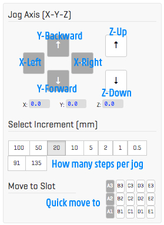
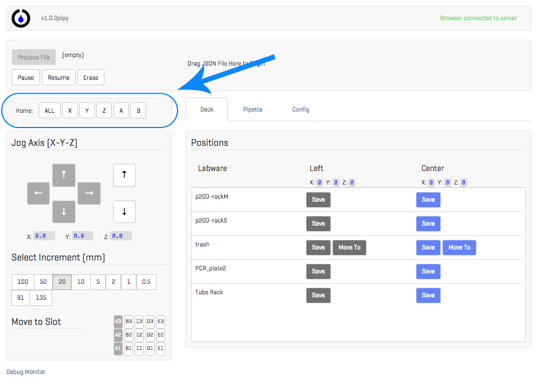

# Jogging Controls

Jogging is when you move the robot by yourself (when there is no protocol running) by clicking one of the arrow buttons in the interface. These are the jog controls:

These are what each button does:

Try clicking around to move the robot.

### Crash!

You are going to crash the robot -- don't worry, it is a matter of *when* not *if* you crash, and your OT.One can handle it. You just need to know what to do when it happens.

*Homeing:* The robot has a home switch on each of its axes, the XYZ of the gantry and the AB for the pipettes. To find its 'home' (or zero point) for each, it moves down that axis until it clicks one of those switches. When it hits a switch, it knows it has reached the minimum point for that axis. Every position you will set later for the OT.One to run a protocol  is defined relative to this 'home' or 'zero' position.

When you crash the robot, the robot is no longer in sync with its 'home' -- its zero point is going to be thrown off due to the crash. So, you need to re-home the robot. These are the homing controls:

You can home each axis individually or all of them at once. Try homing the robot!

Sweet, now on to the next phase: [Choose and Edit a Protocol](Choose_Edit.md)!

