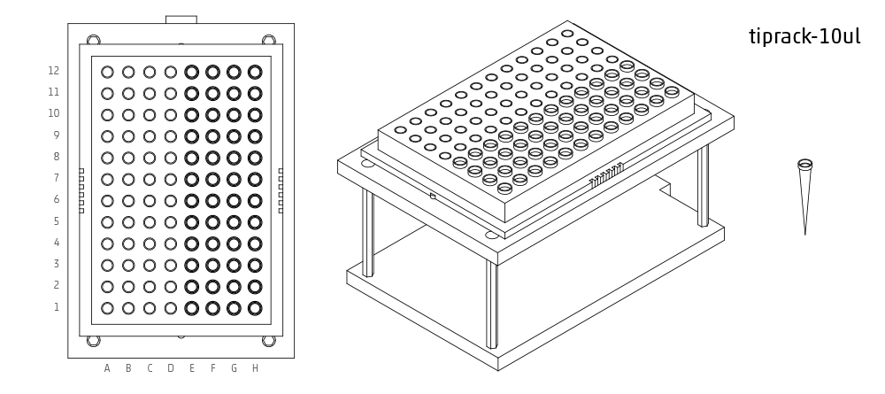

## List of Labware

Note:  All names are case-sensitive, copying and pasting from this list into the protocol editor will ensure no errors are made.

point - For when the position is always going to be the same, such as the trash or a scale
(A1)

tiprack-10ul - Tip rack for a 10 uL pipette (single or multi)
(A1, A1-H12)

tiprack-10ul-H - Tip rack for a single channel 10 uL pipette when the pipette is in the center position.  Set initial position to H1, and the pipette will use all the tips on the right hand side (E-H, 1-12).
(H1, E1-H12)

tiprack-200ul - Tip rack for a 200 or 300 uL pipette (single or multi)
(A1, A1-H12)

tiprack-1000ul - Tip rack for a 1000 uL pipette (single or multi)
(A1, A1-H12)

tiprack-1000ul-chem - Tip rack for 1000ul chem
(10x10)

trough-12row - 12 row reservoir
(A1, A1-A12)

tube-rack-.75ml - 4x6 rack that holds .75 mL microcentrifuge tubes
(A1, A1-D6)

tube-rack-2ml - 4x6 rack that holds 1.5 mL microcentrifuge tubes and 2 mL microcentrifuge tubes
(A1, A1-D6)

tube-rack-15_50ml - rack that holds 6 15 mL tubes and 4 50 mL tubes
(A1, A1-A3 B1-B3 C1-C2 D1-D2)

96-deep-well - 96 well plate
(A1, A1-H12)

96-PCR-tall - 96 well plate
(A1, A1-H12)

96-PCR-flat - 96 well plate
(A1, A1-H12)

PCR-strip-tall
(A1, A1-8)

384-plate
(A1, A1-P24)

