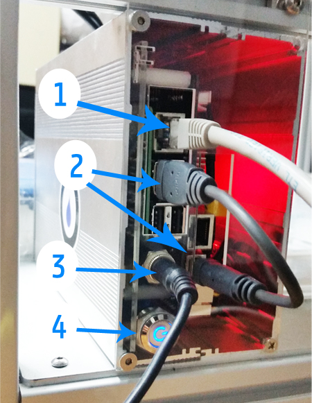
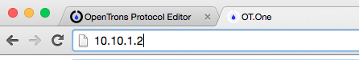
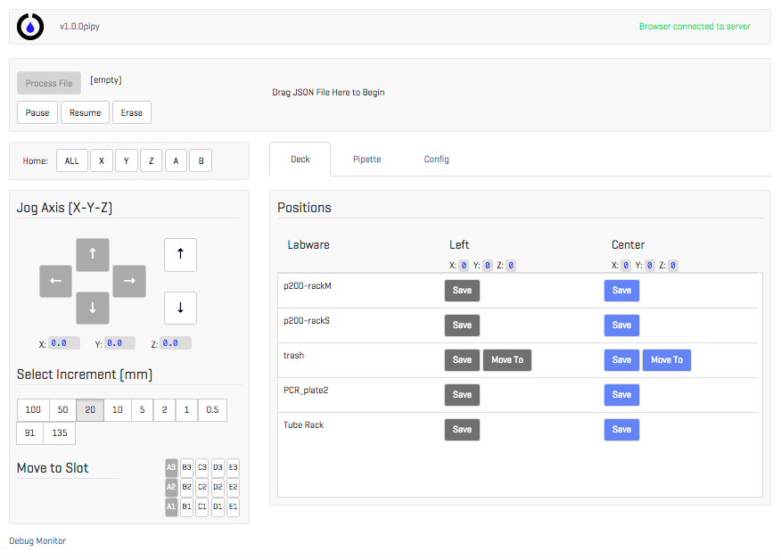
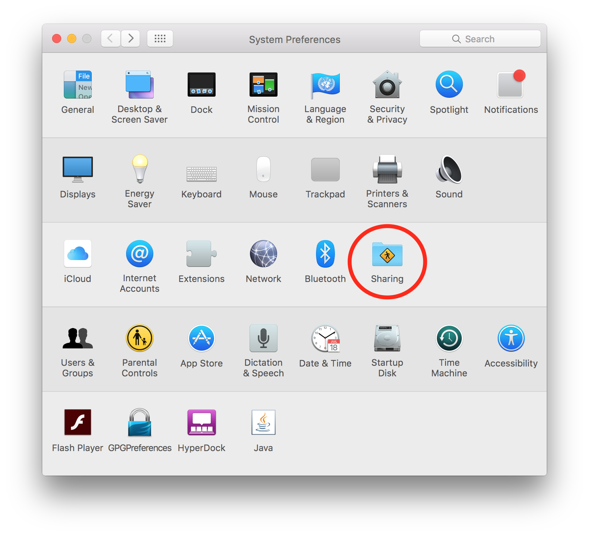

# OT.One Set-up _Mac OSX_

## Plug things in

First thing to do is plug everything in correctly.

1. Plug the ethernet cable from your computer into the Raspberry Pi.
2. The Raspberry Pi to the Smoothieboard with the short USB-A to USB-B.
3. Smoothieboard to 12V powersupply in wall socket. This is the round barrel jack and larger power brick.
4. Hit the on button to send power to the motors.

Finally, connect the Raspberry Pi to 5V power supply in wall socket. This is the micro-USB like an Android phone charger, and goes in the top of the Raspberry Pi in the slit in the aluminum box.

When you plug in the Raspberry Pi it will begin to boot up.  In approximately three minutes, the motors should begin to move as the robot runs through its homing procedure.

## Configure Network Settings

The Raspberry Pi contains a small webserver which runs the interface for calibrating and operating the robot.  To access this webserver, you must connect to your computer over the ethernet cable and connect to the Raspberry Pi using your web browser.

You need to manually set some network settings the first time you do this.

*Note: you will not be able to see the interface until the Raspberry Pi has finished booting up.  You can tell when this has happened because the robot will begin to run its motors for a home sequence.*

### 1. Enter System Preferences

Navigate to the OSX System Preferences and click on the Networking icon.

### 2. Select the Ethernet connection

The Ethernet connection should connect you through the cable going between your computer and the Raspberry Pi.

Change the Configure IPv4 drop-down menue to "Using DHCP with manual address." Set the address to 10.10.1.1.  Set the Subnet Mask to 255.255.255.0, and the router to 10.10.1.2. Then click 'Apply.'

### 3. Navigate to the Local Website

The Raspberry Pi runs a local webserver which serves the calibration website.

Open a browser, or create a new tab in the browser you already have open (Chrome works well). Type [10.10.1.2](http://10.10.1.2) into the address bar and press 'Enter.'  This is a special URL that connects your computer to the Raspberry Pi through the local network.

### 4. Refresh the browser

You should see the OT.One Interface! Make sure it is green and says 'Browser Connected to Server.'

If you do not see the screen pictured below, please contact support for further assistance.

Once you have all that, its time to move the robot! Go to the next step: [Jogging Controls](Jogging_Controls.md).

### 5. BONUS - Enable Network Sharing for Updating

Enabling Network Sharing allows for updating software to the latest version.

Open _Sharing_ in _System Preferences_...

and make the checkmarks look like those in screenshot below.

There should be a prompt asking _Are you sure you want to turn on Internet sharing?_. Click _Start_. Your Mac should now be sharing its Internet connection with the robot, but you may have to wait a moment for the changes to propagate.

