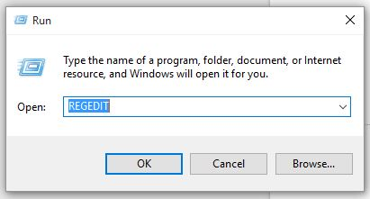
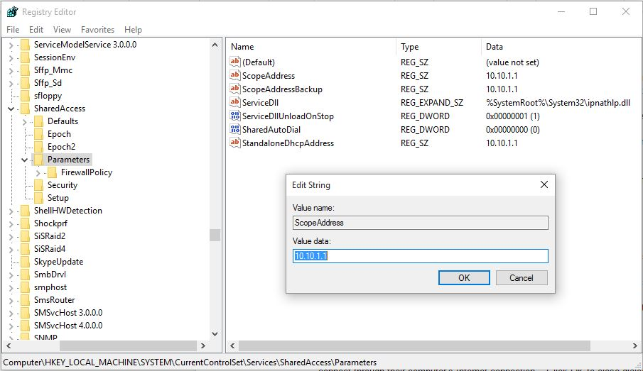
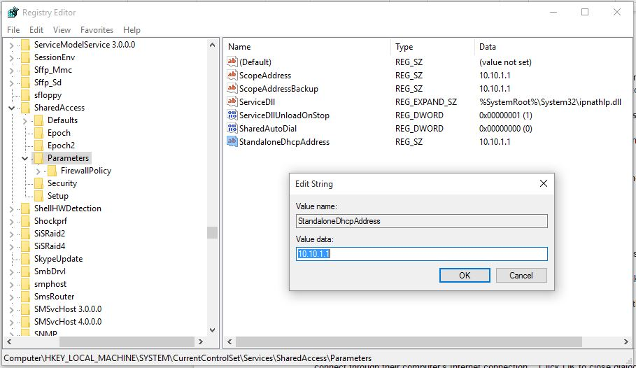
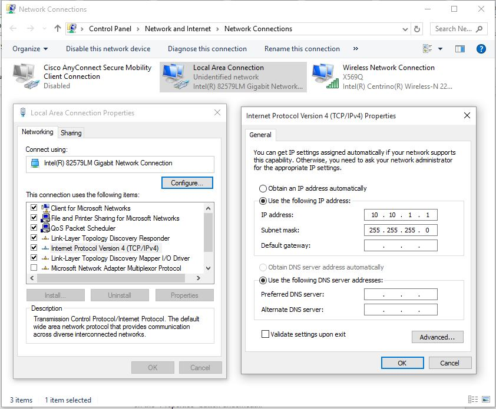

# OT.One Set-up *Windows 7*

### Plug things in

First thing to do is plug everything in correctly.

1. Plug the Ethernet cable from your computer into the RPi.
2. The RPi to the Smoothieboard with the short USB-A to USB-B.
3. Smoothieboard to 12V power supply in wall socket. This is the round barrel jack and larger power brick.
4. Hit the on button to send power to the motors.

Finally, connect the RPi to 5V power supply in wall socket. This is the micro-USB like an Android phone charger, and goes in the top of the RPi in the slit in the aluminum box.

_When you plug in the RPi, the robot will begin to boot up,_ and the motors will home at the end of boot (approx 3 minutes). Be ready for the motors to move before plugging in the RPi!

### Configure Network Settings

Required: Windows 7 PC with an Ethernet port (or USB to Ethernet dongle)

1) Using an administrators account, open the "RUN" window, enter "REGEDIT" and click OK.  On the "User Account Control" confirmation box, click the "Yes" button.

2) On the open "Registry Editor" window, on the left pane, go to "HKEY_LOCAL_MACHINE\System\CurrentControlSet\Services\SharedAccess\Parameters"

3) In the listed parameters in the right pane, double click "ScopeAddress" to open the "Edit String" box and change the "Value data" to "10.10.1.1" and then click OK.

4) Next, double click "StandaloneDHCPAddress" to open the "edit String" box and change the "Value data" to "10.10.1.1" and then click OK.

5) Close the Registry Editor window.

6) Restart the computer to activate the new settings.

7) Open "Control Panel"/"Network and Sharing Center".

8) In "Network and Sharing Center", click on "Change adapter settings" on the left side.  You should see a wireless connection and an unidentified network.

9) Right click on "Local Area Connection" and then click "Properties".

10) Click on "Internet Protocol Version 4 (TCP/IPv4)" in the list, and then click on the "Properties" button underneath.

11) Select the "Use the following IP Address" button and enter "10.10.1.1." as the IP Address.  Set the subnet mask to "255.255.255.0".

12) Click OK to close the "Properties" window.

13) Open browser and navigate to http://10.10.1.2.  The page may need to be refreshed.

14) Robot GUI will appear in browser and display a green status message in upper right hand corner ("Browser Connected to Server") and the user can move the robot head using the controls on the GUI.

15) Click on the "Config" tab.  The green "online" indicator under the "Connect" button should be visible.

Once you have all that, its time to move the robot! Go to the next step: [Jogging Controls](Jogging_Controls.md).

