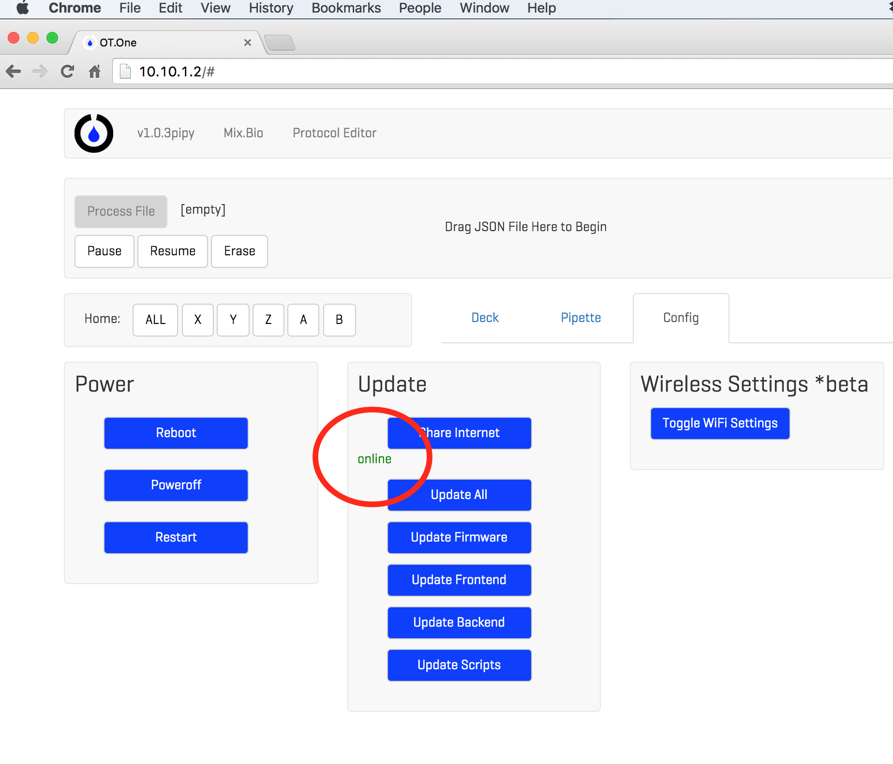
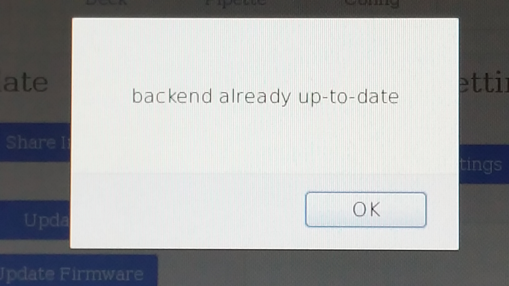
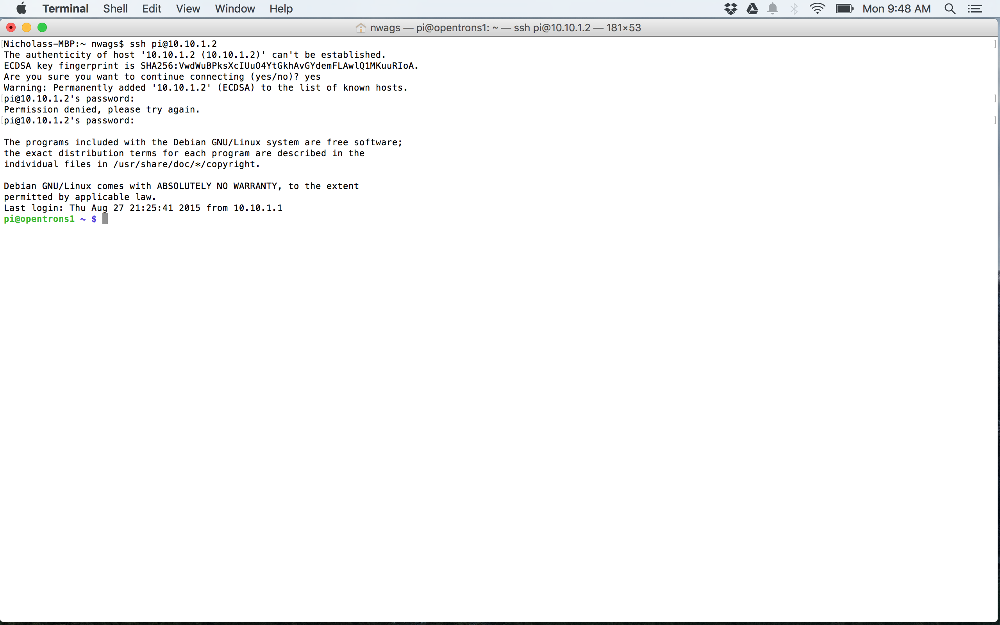
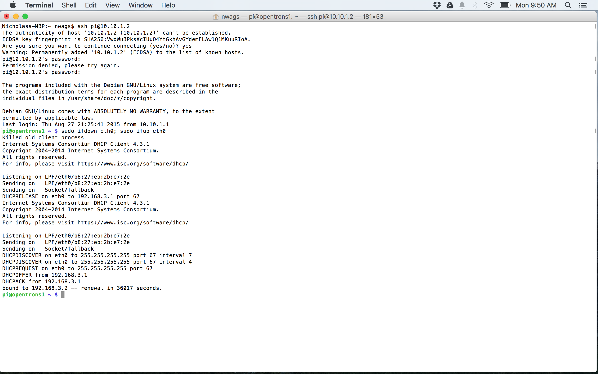
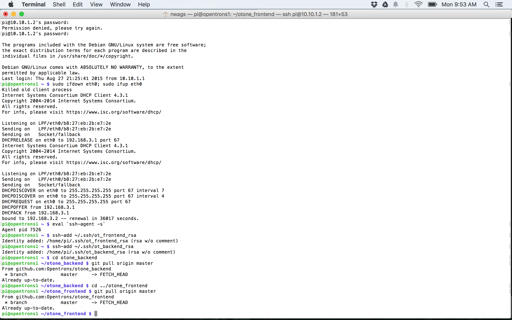
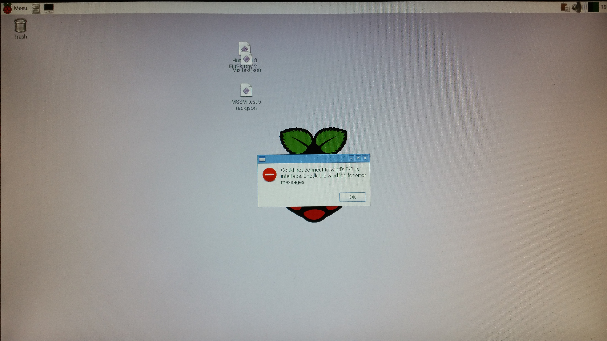
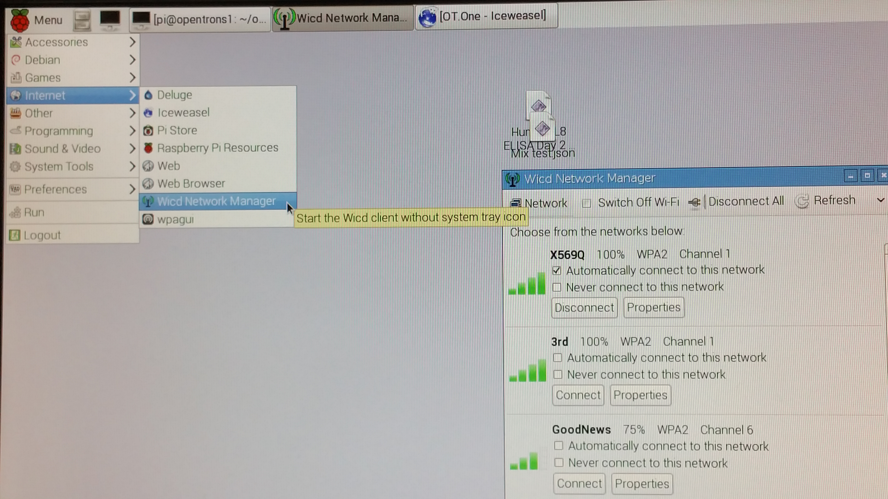

# Software Updating Guide

The software running on the OT.One's Raspberry Pi can be updated to the latest release in two ways. The first way uses the "Config" tab in the user interface, but is sometimes not reliable. The second way is more reliable, but more cumbersome requiring either connecting to the Raspberry Pi headless, meaning using SSH to connect to the Raspberry Pi from your client computer, or operating the Raspberry Pi directly with a monitor, keyboard, mouse, and WiFi USB adapter.

## 1. User Interface - "Config" Tab

 1. Ensure your networking configuration is configured with internet sharing enabled according to the Setup Guide for your machine.

 [Mac](https://github.com/OpenTrons/otone_docs/blob/master/Setup_Mac.md "Mac Setup Guide")

 [PC](https://github.com/OpenTrons/otone_docs/blob/master/Setup_Windows.md "PC Setup Guide")

 2. In the OT.One browser user interface, http://10.10.1.2, select the "Config" tab

 3. Click on "Share Internet" and wait for notification that internet sharing succeeded. There may be several popup notifications, but after closing them, your screen should look like the picture below if it succeeded.

	4. Click "Update Backend", then wait for notification that update has occurred

	5. Click "Update Frontend", then wait for notification that update has occurred

	6. Click "Reboot" and wait for the machine to finish its homing sequence.
	7. Open the browser user interface at http://10.10.1.2 and verify that the version has changed.

## 2. Direct to Raspberry Pi

### a. Headless (SSH, Mac or Linux)

		1. Open a terminal window
		2. Enter the following commands:
			> ssh pi@10.10.1.2

		Confirm ssh connection established, password is *raspberry

			> sudo ifdown eth0; sudo ifup eth0

		Confirm that internet connection has been established

			> eval `ssh-agent -s`
			> ssh-add ~/.ssh/ot_frontend_rsa
			> ssh-add ~/.ssh/ot_backend_rsa
			> cd otone_backend
			> git pull origin master

		Confirm backend pulled

			> cd ./otone_frontend
			> git pull origin master

		Confirm frontend pulled

			> sudo reboot

		Robot should reboot and home

		3. Open the browser user interface at http://10.10.1.2 and verify that the version has changed.

### b. Monitor, Keyboard, Mouse, Wifi USB Adapter

		1. Connect your WiFi USB adapter to one of the empty usb ports on the Raspberry Pi
		2. Connect a HDMI monitor to the exposed HDMI connector on the Raspberry Pi
		3. Connect a standard usb keyboard to one of the empty usb ports on the Raspberry Pi
		4. Start the Raspberry Pi and wait for the desktop screen to appear. If a warning appears it can be ignored and you can click "ok" to make it go away.

		5. Open Wicd Network Manager and connect to the internet with your WiFi network

		6. Open LXTerminal and enter the following commands

			> eval `ssh-agent -s`
			> ssh-add ~/.ssh/ot_frontend_rsa
			> ssh-add ~/.ssh/ot_backend_rsa
			> cd otone_backend
			> git pull origin master

		Confirm backend pulled

			> cd ./otone_frontend
			> git pull origin master

		Confirm frontend pulled

			> sudo reboot

		Robot should reboot. You should wait for the robot to reboot and home.

		7. Open the browser user interface at http://10.10.1.2 and verify that the version has changed.

