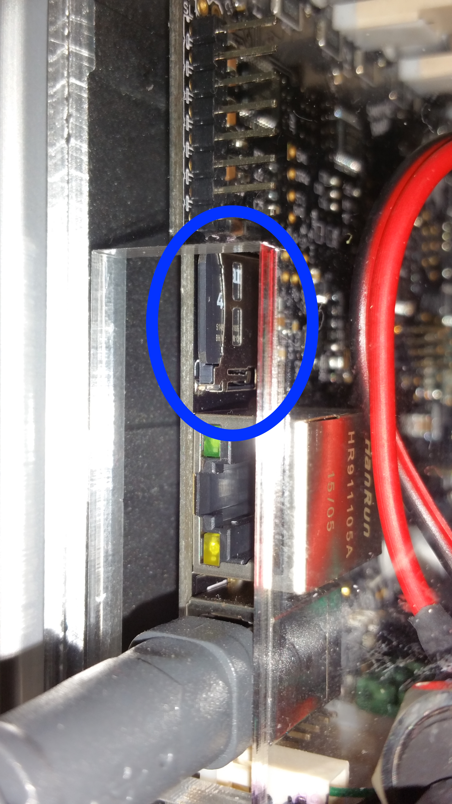
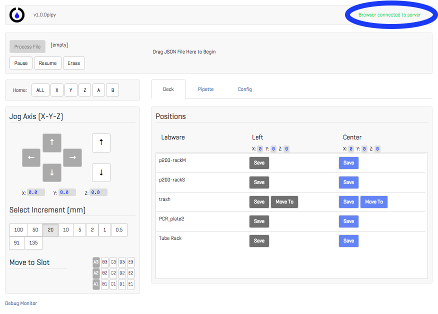
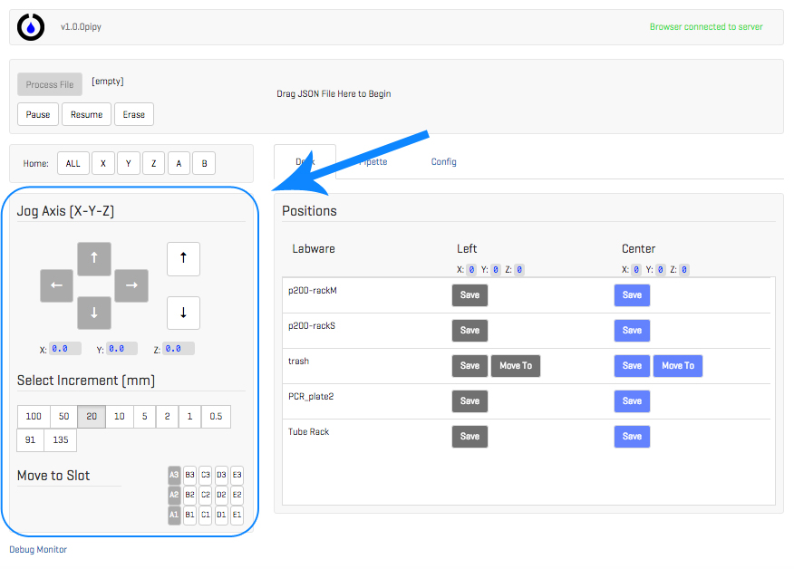
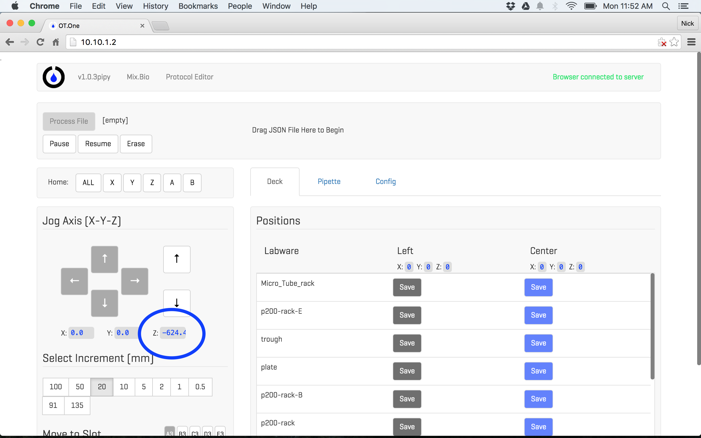

# Troubleshooting Guide

## Introduction

Please use this guide to help identify and resolve possible problems you may be having with the OT-One.

## Prerequisites

The first step is to ensure the initial conditions for the OT.One without yet powering on the OT-One's Raspberry Pi.
The initial conditions are as follows:

### 1. Wired connections must be set properly (without powering on the Raspberry Pi):

The wired connections of your OT-One should match the picture in Figure 1.

	a. (RPi Power) Power to the Raspberry Pi: The RPi Power supply should provide 5V and 2A.

	b. (Motor Power) Power to the OT-One motors: The Motor Power supply should provide 12-24V
	                 and approximately 4A.

	c. (RPi-Smoothie USB) USB cable between the Raspberry Pi and the Smoothieboard

	d. (Ethernet cable) The Ethernet cable between the Raspberry Pi and the client computer

Figure 1: Prerequisite Cable Configuration

### 2. Micro SD cards on the Smoothieboard and Raspberry Pi are inserted properly. See Figure 2.

	a. Smoothieboard Micro SD card.

	b. Raspberry Pi Micro SD card. The Raspberry Pi Micro SD card is inside the Control Box and
	   cannot be accessed without opening the box. For the purposes of this guide, it should not
	   be checked at this point, but if it is an issue, later sections of this guide should
	   address it.

Figure 2: Smoothieboard Micro SD Card Slot

### 3. Motor Power button is depressed. See Figure 1, b.

### 4. Network configuration settings. Network configuration settings should be set according to the computer you are using:

Mac: [MAC NETWORK SETUP GUIDE](https://github.com/Opentrons/otone_docs/blob/master/Setup_Mac.md#configure-network-settings)

Windows: [WINDOWS NETWORK SETUP GUIDE](https://github.com/Opentrons/otone_docs/blob/master/Setup_Windows.md#configure-network-settings)

## Troubleshooting Steps

If you have not reviewed the prerequisites and ensured that the OT-One is setup accordingly, please
go to Prerequisites and do so now.

Now that the Prerequisite are established, please follow these steps:

### Turn on the OT-One by plugging in the OTOne's Raspberry Pi. Wait 3 minutes for the OT-One to "home".

#### I. Did the robot "home"? YES

Attempt to open the user interface in your browser at http://10.10.1.2

	Does the browser load with a green message "Browser connected to server" in
	the top right? See Figure 3.

Figure 3: Browser Connected Screenshot

	If so, please proceed to the next step.

	If not, try refreshing the page and reviewing number 4 of the
	Prerequisites. If that does not resolve the issue, it indicates that
	the backend client has stopped and you should submit an email here for
	further assistance and include "YES HOME 1" in the subject line:
	<info@opentrons.com>

Attempt to jog one of the axes, for example stepping X 20mm. See Figure 4.

Figure 4: Jog Screenshot

Does the jog succeed?

If so, the OT-One appears to be running correctly. Try to run a protocol.
If there are additional issues, please submit an email here for further
assistance and include "YES HOME 2" in the subject line: <info@opentrons.com>

If not, proceed to the next step.

What is the version displayed in the top left of the user interface? e.g. v1.0.1pipy

If the version of software is not the latest, the software should be updated.
If updating does not resolve the problem, it indicates that there could be a
problem with the microcontroller and further technical assistance is required.
Please submit an email here for further assistance and include "YES HOME 3" in the subject line:
<info@opentrons.com>

Please follow this guide to update: [UPDATE GUIDE](https://github.com/Opentrons/otone_docs/blob/master/SoftwareUpdatingGuide.md)

#### II. Did the robot "home"? NO

Attempt to open the user interface in your browser at [http://10.10.1.2](http://10.10.1.2).

Does the browser load with a green message "Browser connected to server" in the top right? See Figure 3.

Figure 3: Browser Connected Screenshot

If not, try refreshing the page and reviewing number 4 of the Prerequisites. If that does not resolve the issue, it indicates that the backend client has stopped and you should submit an here with "NO HOME 1" in the subject line for further assistance: <info@opentrons.com>

If so, please proceed to the next step.

Does the browser indicate that certain axes are moving, even though the OT.One did not home? See Figure 5.

Figure 5: Axes Homing Screenshot

If so, it indicates that the OT-One is attempting to home, but there is a problem with power going to the motors. Please submit an email here with "NO HOME 2" in the subject line for further assistance: <info@opentrons.com>

